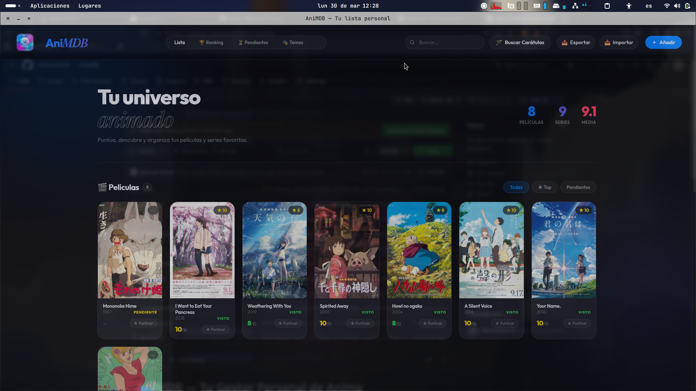
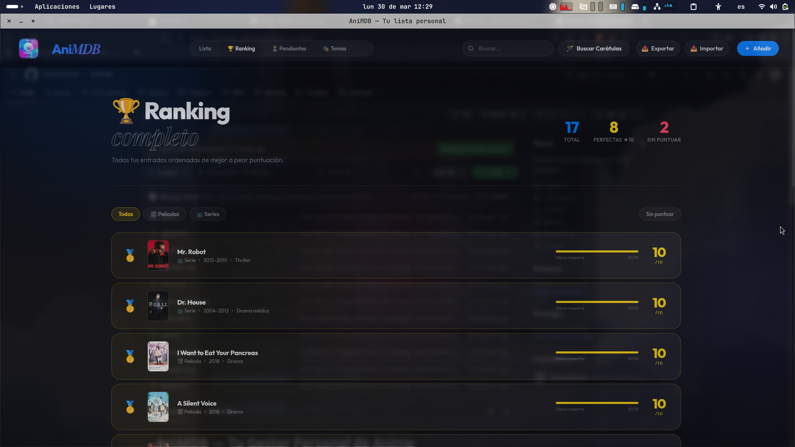
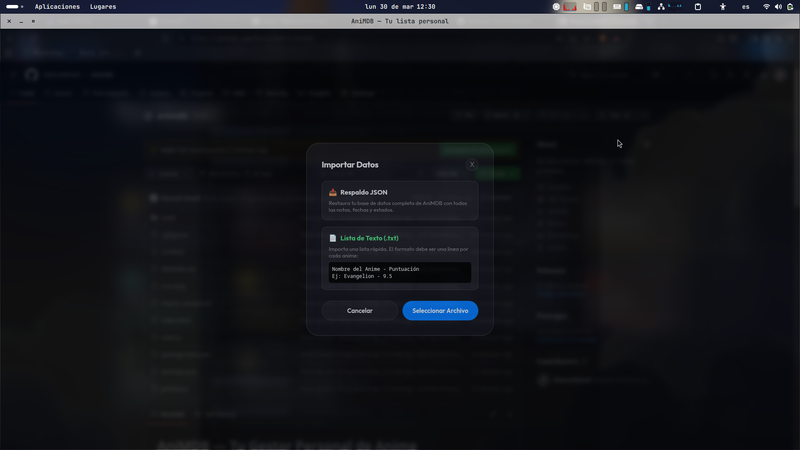
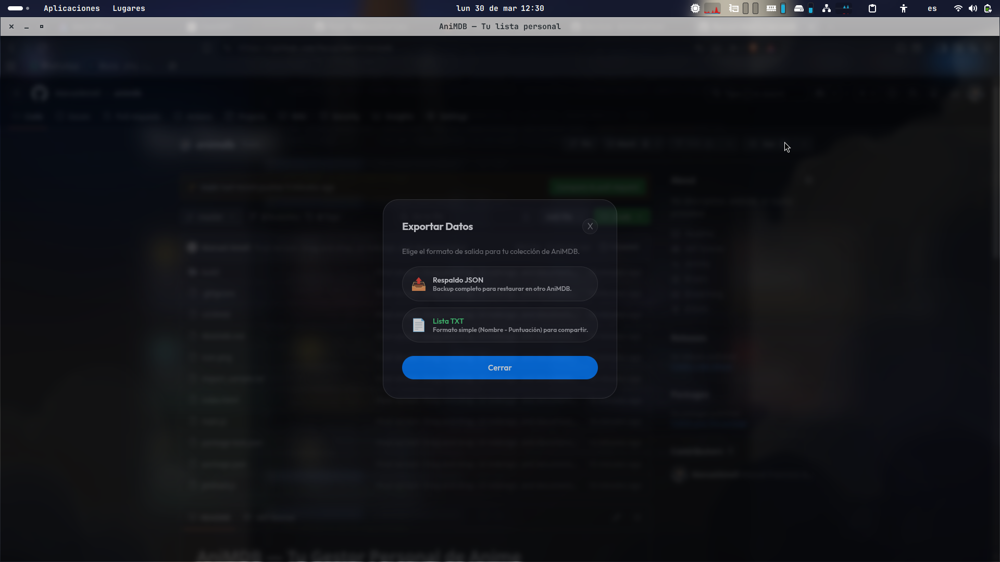

# AniMDB — Tu Gestor Personal de Anime

**AniMDB** es una aplicación de escritorio ligera, rápida y minimalista diseñada para ayudarte a organizar tu colección de anime y películas. Construida con **Electron** y con una estética **Premium Glassmorphism**, ofrece una experiencia de usuario fluida y moderna diseñada para mi disfrutenla.


## 🚀 Características Principales

- **✨ Interfaz Glassmorphic**: Un diseño visualmente impactante con efectos de desenfosque dinámicos y animaciones suaves.
- **⭐ Puntuación con Mitades**: Sistema de calificación preciso de 0 a 10 con incrementos de 0.5.
- **⚡ Selector Rápido**: Puntúa tus animes directamente desde la tarjeta con un solo clic.
- **↕️ Reordenación Drag-and-Drop**: Organiza tu Ranking simplemente arrastrando los elementos para cambiar su posición (incluso con la misma puntuación).
- **📥 Importación Inteligente**: Soporte para archivos `.json` (backups) y `.txt` (formato `Nombre - Puntuación`).
- **🔍 Búsqueda de Metadatos**: 
  - Búsqueda por nombre: Integración con Jikan (MyAnimeList), TMDB y TVMaze
  - Búsqueda por ID: IMDB ID (OMDb), Kitsu ID, MyAnimeList ID
- **⏳ Sección de Pendientes**: Vista dedicada con secciones separadas para Películas, Series y Series Anime.
- **🗂️ Organización Avanzada**: Filtra por categorías, estados (Visto, Viendo, Pendiente) y estados de ánimo (Moods) con estilo glass.

## 📸 Capturas de Pantalla

| Vista Principal | Ranking de Anime |
| :---: | :---: |
|  |  |

| Importación de Datos | Exportación y Backup |
| :---: | :---: |
|  |  |

## 🛠️ Instalación y Uso
- [Node.js](https://nodejs.org/) instalado en tu sistema.

### Pasos para ejecutar
1. Clona este repositorio:
   ```bash
   git clone https://github.com/ManuelAmell/animdb.git
   cd animdb
   ```
2. Instala las dependencias:
   ```bash
   npm install
   ```

### Scripts Disponibles

| Comando | Descripción |
|---------|-------------|
| `npm run dev` | Inicia el servidor de desarrollo (Vite) |
| `npm run build` | Compila TypeScript y construye la app |
| `npm run preview` | Pre-visualiza la build de producción |
| `npm start` | Inicia la aplicación Electron |
| `npm run electron:dev` | Ejecuta Vite + Electron en modo desarrollo |
| `npm run electron:build` | Build de producción + paquete Electron |
| `npm run build:win` | Construir instalador para Windows |
| `npm run build:mac` | Construir instalador para macOS |
| `npm run build:linux` | Construir instalador para Linux |

### Desarrollo
```bash
# Modo desarrollo
npm run dev

# Con Electron
npm run electron:dev
```

### Producción
```bash
# Construir app
npm run build

# Empaquetar para distribución
npm run electron:build
```

### Descargas Pre-compiladas
Los instaladores pre-compilados se encuentran en la carpeta `dist-electron/`:
- **Windows**: `AniMDB Setup 1.0.0.exe` (NSIS installer)
- **macOS**: `AniMDB-1.0.0.dmg` (requiere build en Mac)
- **Linux**: `AniMDB-1.0.0.AppImage` (requiere build en Linux)

## 📜 Licencia

Este proyecto está bajo la Licencia **MIT**. Consulta el archivo [LICENSE](LICENSE) para más detalles.

---
*Hecho con ❤️ para la comunidad Otaku.*
